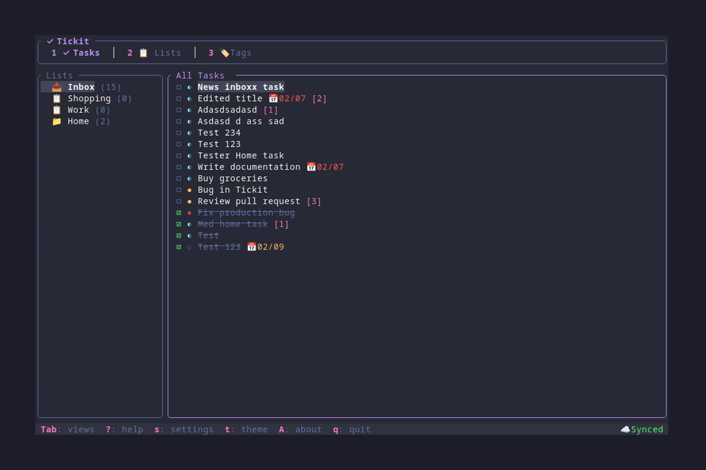

<p align="center">
  
</p>

<h1 align="center">
  ✓ Tickit
</h1>

<p align="center">
  <strong>A stunning terminal-based task manager with CLI and TUI</strong>
</p>

<p align="center">
  <i>Organize your tasks, lists, and tags — all from your terminal.</i>
</p>

<p align="center">
  <a href="https://github.com/ricardodantas/tickit/releases">
    
  </a>
  <a href="https://crates.io/crates/tickit">
    
  </a>
  <a href="https://github.com/ricardodantas/tickit/blob/main/LICENSE">
    
  </a>
  <a href="https://rust-lang.org">
    
  </a>
</p>

<br>

## 📖 Table of Contents

- [✨ Features](#-features)
- [🚀 Quick Start](#-quick-start)
- [💻 CLI Commands](#-cli-commands)
- [⌨️ Keybindings](#️-keybindings)
- [🎨 Themes](#-themes)
- [📤 Export Formats](#-export-formats)
- [🔧 Building from Source](#-building-from-source)
- [🤝 Contributing](#-contributing)
- [📄 License](#-license)

<br>

## ✨ Features

<table>
<tr>
<td width="50%">

### 📋 Task Management
Create, edit, and complete tasks with titles, descriptions, URLs, and priority levels.

### 📁 Lists
Organize tasks into lists with a default Inbox for quick capture.

### 🏷️ Tags
Add colorful tags for flexible categorization and filtering.

</td>
<td width="50%">

### 🖥️ Beautiful TUI
A gorgeous terminal interface with vim-style navigation and real-time updates.

### ⌨️ Full CLI
Script your task management with powerful command-line tools.

### 📤 Export Anywhere
Export to JSON, todo.txt, Markdown, or CSV formats.

</td>
</tr>
</table>

<br>

### Feature Highlights

| Feature | Description |
|---------|-------------|
| ⚡ **Priority Levels** | None, Low, Medium, High, Urgent |
| 🔗 **Task URLs** | Attach links and open them with `o` |
| 🎨 **15 Built-in Themes** | From Dracula to Cyberpunk |
| 💾 **SQLite Storage** | Fast, reliable, self-contained |
| 🔍 **Filter & Search** | By list, tag, or completion status |
| ✅ **Toggle Completed** | Show/hide completed tasks |

<br>

## 🚀 Quick Start

### Installation

#### From Source

```bash
git clone https://github.com/ricardodantas/tickit
cd tickit
cargo install --path .
```

#### From crates.io (coming soon)

```bash
cargo install tickit
```

### First Run

Simply launch the TUI:

```bash
tickit
```

Your tasks are stored in SQLite at `~/.config/tickit/tickit.sqlite`.

<br>

## 💻 CLI Commands

```bash
# Add a task
tickit add "Buy groceries" --priority high --list Shopping
tickit add "Review PR" --url "https://github.com/..." --tags work,urgent

# List tasks
tickit list                    # Show incomplete tasks
tickit list --all              # Include completed
tickit list --list Work        # Filter by list
tickit list --tag urgent       # Filter by tag
tickit list --json             # Output as JSON

# Complete/uncomplete
tickit done "Buy groceries"
tickit undo "Buy groceries"

# Delete
tickit delete "Old task"
tickit rm "Old task" --force   # Skip confirmation

# Manage lists
tickit lists                   # List all lists
tickit lists add "Shopping" --icon "🛒"
tickit lists delete "Old List"

# Manage tags
tickit tags                    # List all tags
tickit tags add "urgent" --color "#ff0000"
tickit tags delete "old-tag"

# Export
tickit export --format json --output tasks.json
tickit export --format todotxt
tickit export --format markdown --list Work
tickit export --format csv
```

<br>

## ⌨️ Keybindings

### Global

| Key | Action |
|-----|--------|
| `Tab` | Next view |
| `Shift+Tab` | Previous view |
| `1` `2` `3` | Jump to view (Tasks, Lists, Tags) |
| `t` | Open theme picker |
| `A` | About Tickit |
| `?` / `F1` | Show help |
| `q` | Quit |
| `Ctrl+c` / `Ctrl+q` | Force quit |

### Navigation

| Key | Action |
|-----|--------|
| `↑` / `k` | Move up |
| `↓` / `j` | Move down |
| `←` / `h` | Focus sidebar |
| `→` / `l` | Focus main |
| `g` / `Home` | Go to first item |
| `G` / `End` | Go to last item |

### Tasks View

| Key | Action |
|-----|--------|
| `Enter` / `Space` | Toggle task complete |
| `n` | Create new task |
| `e` | Edit selected task |
| `d` / `Delete` | Delete selected task |
| `p` | Cycle priority |
| `o` | Open task URL |
| `c` | Toggle show completed |
| `r` | Refresh |

### Lists/Tags View

| Key | Action |
|-----|--------|
| `n` | Create new item |
| `e` | Edit selected item |
| `d` / `Delete` | Delete selected item |

### Task Editor

| Key | Action |
|-----|--------|
| `Tab` | Next field |
| `Shift+Tab` | Previous field |
| `Enter` | Save task |
| `Esc` | Cancel |
| `Space` | Toggle tag (in Tags field) |
| `j` / `k` | Navigate options |

<br>

## 🎨 Themes

Tickit includes **15 beautiful themes** based on popular terminal and editor color schemes.

Press `t` in the TUI to open the theme picker with live preview.

### Available Themes

| Theme | Description |
|-------|-------------|
| 🦇 **Dracula** | Dark purple aesthetic (default) |
| 🌙 **One Dark Pro** | Atom's iconic dark theme |
| ❄️ **Nord** | Arctic, bluish color palette |
| 🐱 **Catppuccin Mocha** | Warm pastel dark theme |
| ☕ **Catppuccin Latte** | Warm pastel light theme |
| 🎸 **Gruvbox Dark** | Retro groove colors |
| 📜 **Gruvbox Light** | Retro groove, light variant |
| 🌃 **Tokyo Night** | Futuristic dark blue |
| 🌅 **Solarized Dark** | Precision colors, dark |
| 🌞 **Solarized Light** | Precision colors, light |
| 🎨 **Monokai Pro** | Classic syntax highlighting |
| 🌹 **Rosé Pine** | All natural pine with soho vibes |
| 🌊 **Kanagawa** | Inspired by Katsushika Hokusai |
| 🌲 **Everforest** | Comfortable green forest theme |
| 🌆 **Cyberpunk** | Neon-soaked futuristic theme |

<br>

## 📤 Export Formats

### JSON

Full data export with all fields — perfect for backups or integrations.

```bash
tickit export --format json --output tasks.json
```

### todo.txt

Compatible with the [todo.txt](http://todotxt.org/) format:

```
(A) 2024-01-01 Task title +Project @context due:2024-01-15
```

```bash
tickit export --format todotxt
```

### Markdown

Human-readable format with checkboxes:

```markdown
## 📥 Inbox
- [ ] 🔴 Urgent task
- [x] Completed task
```

```bash
tickit export --format markdown
```

### CSV

Spreadsheet-compatible format for Excel, Google Sheets, etc.

```bash
tickit export --format csv --output tasks.csv
```

<br>

## 🔧 Building from Source

### Requirements

- **Rust 1.93+** (uses Edition 2024 features)
- **Linux**, **macOS**, or **Windows**

### Build

```bash
# Clone the repository
git clone https://github.com/ricardodantas/tickit
cd tickit

# Build release binary
cargo build --release

# The binary will be at:
# - target/release/tickit

# Or install directly
cargo install --path .
```

### Development

```bash
# Run TUI in development
cargo run

# Run tests
cargo test

# Run linter
cargo clippy

# Format code
cargo fmt
```

<br>

## 📁 Data Storage

| File | Path | Purpose |
|------|------|---------|
| Database | `~/.config/tickit/tickit.sqlite` | Tasks, lists, tags |
| Config | `~/.config/tickit/config.toml` | Theme and settings |

<br>

## 🤝 Contributing

Contributions are welcome! 

1. Fork the repository
2. Create a feature branch: `git checkout -b feature/amazing-feature`
3. Make your changes
4. Run tests: `cargo test`
5. Run clippy: `cargo clippy`
6. Format: `cargo fmt`
7. Commit: `git commit -m "Add amazing feature"`
8. Push: `git push origin feature/amazing-feature`
9. Open a Pull Request

<br>

## 📄 License

This project is licensed under the **MIT License** — see the [LICENSE](LICENSE) file for details.

---

<p align="center">
  <sub>Built with 🦀 Rust and ❤️ by <a href="https://github.com/ricardodantas">Ricardo Dantas</a></sub>
</p>
